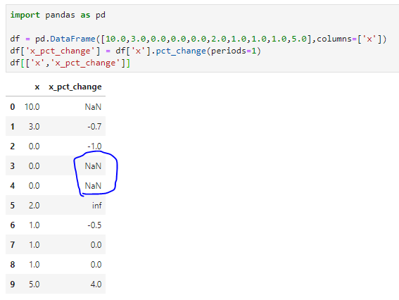
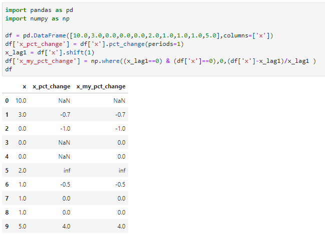

Arrrgghh - I just wasted the best part of an afternoon chasing this one down. If i can knock out a quick post on it then at least i'll feel i've gotten something out of it.

Here's the story - somewhere in an admittedly crazy ETL type pipeline i was using pandas [pct\_change()](https://pandas.pydata.org/pandas-docs/version/0.23.4/generated/pandas.DataFrame.pct_change.html) as a data transformation prior to some downstream modelling. Problem was i was also using [dropna()](https://pandas.pydata.org/pandas-docs/stable/reference/api/pandas.DataFrame.dropna.html) later to ensure only valid data going into the model. I noticed a lot of rows falling out of the data pipeline (print(df[.shape](https://pandas.pydata.org/pandas-docs/stable/reference/api/pandas.DataFrame.shape.html)) is your friend!).

After a lot of debugging, chasing [this dead end](https://stackoverflow.com/questions/36285546/pandas-pct-change-function-returning-wrong-value) down a rabbit hole, cleaning and updating my conda environment (and then dealing with the [tornado issues](https://github.com/jupyter/notebook/issues/4439) that always seems to cause) i realized the answer was staring me in the face the whole time.

Its the 0's!

Turns out my data has lots of zero's and i'm an idiot who assumed (0-0) / 0 = 0 and so the NaN's above should be 0.

But am i really an idiot? I checked...

I guess so.

So let that be a lesson - watch out for 0's when using [pct\_change()](https://pandas.pydata.org/pandas-docs/stable/reference/api/pandas.DataFrame.pct_change.html) - don't be like andrewm4894.

p.s. I could not just fillna() them as i had valid NaN's at the top of my dataframe from the lagged values. So i ended up in a state where some NaN's were valid and some i wanted to be 0 instead. Am guessing i'll have to write a custom pct\_change() type function (which seems a bit crazy). Would be great if was a way to tell pandas pct\_change() i want (0-0)/0=0. Maybe if i get brave enough i'll make a pull request :)

p.p.s. Seems like i'm not the only one: https://brilliant.org/wiki/what-is-0-0/ (though still wrong)

hmmm - maybe i've just wasted more time on this post. Think i need to pack it in for today.

**Update**

Everything is always clearer in the morning, here is a one liner that pretty much behaves as i wanted. I can get back to my life now.

