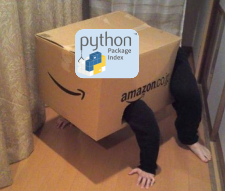

I've been threatening to myself to do this for a long time and recently got around to it, so as usual i'm going to try milk it for a blog post (Note: i'm not talking about getting into a box like the below picture, its something much less impressive).

## Confession - I don't know matplotlib

I have a confession to make that's been eating away at me and i need to get off my chest - i'm pretty useless at plotting anything in Python. I never really had the time/need to sit down and 'learn' matplotlib from first principles (does anyone?). I've usually had tools like Tableau or Looker to sit on top of whatever database i am using and make visualizations pretty painlessly.

When I've needed to do something custom or more complicated it usually goes like this, i spend about a day or two randomly googling around for something that looks close enough to what i need, start playing around with the code (copy paste), then i find some other example i like a little bit more that uses a different library (seaborn, bokeh, plotly etc.) and start the whole painful process over again!

Eventually i settle on some Frankenstein solution that gets me over the line until the next time. After living this cycle many times i decided to some day build my own plotting library that would short circuit this shitshow and over time become the answer to all my plotting needs. And i was hoping it would also be a nice excuse to learn about Python packaging and deploying to PyPI.

## Cookiecutter to the rescue

Turns out, like most other things, there are already great tools out there to make this much easier then i expected it would be - the main one being [cookiecutter](https://cookiecutter.readthedocs.io/en/latest/) and in particular this [cookiecutter template for pypi packages](https://github.com/audreyr/cookiecutter-pypackage) (i also found [this](https://training.talkpython.fm/courses/details/using-and-mastering-cookiecutter-templates-for-project-creation) TalkPython course and [these talks](https://www.youtube.com/watch?v=qOH-h-EKKac&list=PL6Zhl9mK2r0IDU0Yv7HsBb5AsmBCuIsK_) really useful starting points).

## am4894plots

So after a bit of dicking around with cookiecutter i had the basis for my plotting package (see my minimal example 'hello world' type package on PyPI [here](https://pypi.org/project/am4894dev2/)) and just needed to build out my functionality ([am4894plots](https://pypi.org/project/am4894plots/) on PyPI).

I've mostly been working with time series data recently so decided to start there with some common typical plots i might often reach for when looking at such data. My main principles in the package are:

- Usually my data is in a [pandas](https://pandas.pydata.org/) dataframe and that what i want to pass into my plotting function along with a list of what cols i want to plot and as little else as possible.
- I don't care what library i use under the hood and where possible i might even want to implement the same version of a plot in multiple underlying libraries for whatever reason (At the moment it's mainly just either [Plotly](https://plot.ly/python/) or [Bokeh](https://docs.bokeh.org/en/latest/index.html) being used, but i can easily see myself adding more over time as needs arise).
- This package is just for me to use, you are not allowed to use it :)

## Moving parts

The great thing about leveraging something like cookiecutter is you can plug into as many best practice tools as possible with as little sweat as possible on your end. Below are some notable examples of tools or components you get pretty much out of the box that i expected to have to work much harder for.

- Traditional [pytest](https://docs.pytest.org/en/latest/) testing along with [tox](https://tox.readthedocs.io/en/latest/) based test environment automation ([tests folder](https://github.com/andrewm4894/am4894plots/tree/master/tests), [tox.ini](https://github.com/andrewm4894/am4894plots/blob/master/tox.ini)).
- Travis CI out of the box ([latest build](https://travis-ci.org/andrewm4894/am4894plots), [travis.yml](https://github.com/andrewm4894/am4894plots/blob/master/.travis.yml)).
- [bumpversion](https://github.com/c4urself/bump2version) for easy package versioning.
- [readthedocs](https://readthedocs.org/) integration out of the box - nice modern blue theme included ([conf.py](https://github.com/andrewm4894/am4894plots/blob/master/docs/conf.py) used to build the docs, [latest docs](https://am4894plots.readthedocs.io/en/latest/readme.html)).
- [twine](https://twine.readthedocs.io/en/latest/) for uploading built package to PyPI (installed in [requirements\_dev.txt](https://github.com/andrewm4894/am4894plots/blob/master/requirements_dev.txt#L12) and used via cli).
- [PyUp](https://pyup.io/) integration (latest [pyup info](https://pyup.io/repos/github/andrewm4894/am4894plots/)).
- Codecov badge and coverage integration ([codecov](https://codecov.io/gh/andrewm4894/am4894plots)).
- Cool badges in the [readme](https://github.com/andrewm4894/am4894plots/blob/master/README.rst)!

## Examples

I'll finish with some quick examples to illustrate what the package actually does and some ways i'm planing to use it.

### plot\_lines()

\[iframe src="https://nbviewer.jupyter.org/github/andrewm4894/am4894plots/blob/master/examples/lines.ipynb?flush\_cache=false" width="100%" height="1300" scrolling="no" class="iframe-class" frameborder="0"\]

### plot\_scatters()

\[iframe src="https://nbviewer.jupyter.org/github/andrewm4894/am4894plots/blob/master/examples/scatters.ipynb?flush\_cache=false" width="100%" height="875" scrolling="no" class="iframe-class" frameborder="0"\]

### plot\_hists(), plot\_boxes()

\[iframe src="https://nbviewer.jupyter.org/github/andrewm4894/am4894plots/blob/master/examples/dists.ipynb?flush\_cache=false" width="100%" height="1400" scrolling="no" class="iframe-class" frameborder="0"\]

### plot\_heatmap()

\[iframe src="https://nbviewer.jupyter.org/github/andrewm4894/am4894plots/blob/master/examples/heatmap.ipynb?flush\_cache=false" width="100%" height="1150" scrolling="no" class="iframe-class" frameborder="0"\]

## Thats it

That's it, now that i (technically) have a package on PyPI i feel just a little bit less of an impostor :)

