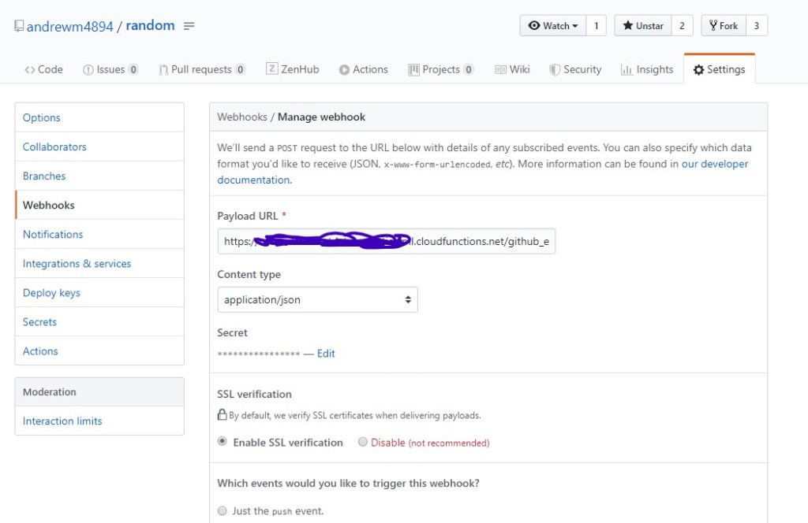
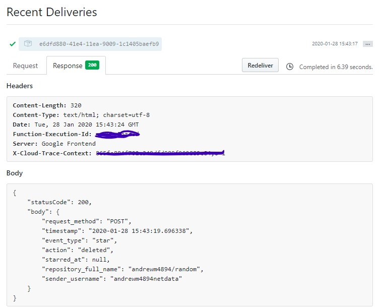
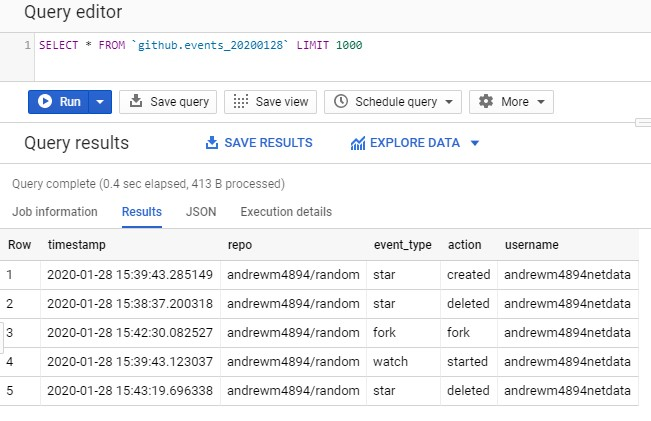

I have recently needed to watch and track various activities on specific github repos i'm working on, however the rest api from Gtihub can sometimes be a bit limited (for example, best i could see, if you want to get the most recent list of people who began watching your repo you need to make a lot of paginated api calls and do battle with rate limiting 💩).

This is where [Github Webhooks](https://developer.github.com/webhooks/) can be a very useful alternative way to trigger certain events of interest to some endpoint where you can then handle the data as you need. The use case i was interested in was triggering an event any time someone starred, unstarred, watched or forked a specific repository. I wanted to then store that info in a table in [Google BigQuery](https://cloud.google.com/bigquery/) where it can be used to track repository activity over time for various reasons you might want (outreach to the community around the repository, or just tracking growth over time).

After the usual few hours of googling around i landed upon the idea of having the webhook for Github send events to a [Google Cloud Function](https://cloud.google.com/functions/), from there my cloud function can process and append the data onto a BigQuery table. To make developing and maintaining the cloud function easy i used [Serverless](https://serverless.com/) and built on [this example](https://serverless.com/examples/google-python-simple-http-endpoint/) in particular.

p.s. i also found [this repository](https://github.com/carlos-jenkins/python-github-webhooks) very useful as well as [this one](https://github.com/bloomberg/python-github-webhook) from Bloomberg. Also i think you could maybe get something similar done without any code using something like [Zapier](https://zapier.com/apps/github/integrations/webhook) (although i don't think they have all the Github Webhook events available).

p.p.s all the code is in [this repo](https://github.com/andrewm4894/cloud-functions/tree/master/handle-github-events).

## Step 1 - Serverless

We start by leveraging [this Serverless example](https://serverless.com/examples/google-python-simple-http-endpoint/) to create the bare bones structure for our cloud function.

In a folder where we want the code to live we run the below to install Serverless if needed, and pull down the _google-python-simple-http-endpoint_ template and save it into a new Serverless project called _handle-github-events_.

https://gist.github.com/andrewm4894/46d292132ed99d99937e3e3558fb78d3

The approach i am taking also depends on using a .env file to handle secrets and enviornmental variables so we also need to install the [serverless-dotenv-plugin](https://serverless.com/plugins/serverless-dotenv-plugin/), and run npm install for everything else we need.

https://gist.github.com/andrewm4894/ba719ffb96218c18337f9b0d41487c18

## Step 2 - Cloud Function

Once we have the bare bones serverless template in place we can build on it to create the function we want for handling incoming requests from the Github webhook. All the code is in [this repository](https://github.com/andrewm4894/cloud-functions/tree/master/handle-github-events) and i'll walk through the main points below.

The core of what we want to do in our Cloud function is in [main.py](https://github.com/andrewm4894/cloud-functions/blob/master/handle-github-events/main.py). What it tries to do is:

1. Validate that the request is coming from a known Github ip address.
2. Validate that the hashed secret key stored in Github when you create your webhook matches what is expected by the cloud function as pulled from the GITHUB\_WEBHOOK\_SECRET environment variable.
3. Parse the json received from the Github request and append it to a table somewhere in BigQuery.
4. Return as the response to Github some info about the event.

https://gist.github.com/andrewm4894/6e3b6d1a7c9ba185d685ca98bb59f5b5

Our serverless.yml file looks like below. Note that it is pulling environment variables required for serverless to deploy from a .env file you would need to create yourself ([here](https://github.com/andrewm4894/cloud-functions/blob/master/handle-github-events/.env.example) is an example in the repo).

https://gist.github.com/andrewm4894/b465ec54dc1aa09f5a32132f5ad8528a

## Step 3 - Deploy

Once we are ready we run \`serverless deploy\` and if all goes well see output like below:

```
>serverless deploy -v
Serverless: DOTENV: Loading environment variables from .env:
Serverless:      - GITHUB_WEBHOOK_SECRET
Serverless:      - GCP_KEY_FILE
Serverless:      - GCP_PROJECT_NAME
Serverless:      - GCP_REGION_NAME
Serverless:      - BQ_DATASET_NAME
Serverless:      - BQ_TABLE_NAME
Serverless:      - BQ_IF_EXISTS
Serverless: Packaging service...
Serverless: Excluding development dependencies...
Serverless: Compiling function "github_event"...
Serverless: Uploading artifacts...
Serverless: Artifacts successfully uploaded...
Serverless: Updating deployment...
Serverless: Checking deployment update progress...
....................
Serverless: Done...
Service Information
service: handle-github-events
project: <your project name will be here>
stage: dev
region: <your region will be here>

Deployed functions
github_event
  https://<your-region>-<your-project-name>.cloudfunctions.net/github_event

Serverless: Removing old artifacts...
```

Now you should have a cloud function alive at some url like [https://your-region-your-project-name.cloudfunctions.net/github\_event](https://-.cloudfunctions.net/github_event).

## Step 4 - Github Webhook

Once your function is deployed (or in reality you might make the Gtibhub webhook first and then iterate on the function to get it doing what you want) you can create and test Github Webhook you want to send events from.

In my case and for this post i'm going to add the webhook to my [andrewm4894/random](https://github.com/andrewm4894/random) repository for illustration. Payload URL is the url of the cloud function we created and Secret should be the same string you are storing in your .env file as "GITHUB\_WEBHOOK\_SECRET".



Check whatever events you want to trigger on - i'm my case it was star, watch and fork events (Note: the function might not work if you were to send all events or different events - you would just need to adapt it accordingly).


## Fingers Crossed

Now we can try see if it works by triggering some events. In this example i logged on as a second username i have and pressed some star, watch, and fork buttons to see what happened.

You can see recent triggers of the webhook in Github and this can be very useful for debugging things and while developing.

<figure>


<figcaption>

An example request sent to the cloud function.

</figcaption>

</figure>

And you can also see the response received from the cloud function. In this case showing that "andrewm4894netdata" (my other user) deleted a star from the "andrewm4894/random" repository 😔.

<figure>



<figcaption>

Example response back from our cloud function.

</figcaption>

</figure>

And then finally we can see the stored events in our table in BigQuery:

<figure>



<figcaption>

We have the data!!

</figcaption>

</figure>

And that's it! We have our Github Webhook sending events to our Google Cloud Function which is in turn appending them onto a daily table in BigQuery. Go Webhooks!
