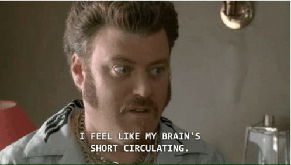

This took me waaay too long to work out today and i was thinking it could make a nice little interview coding type question (which i'd probably fail).

Suppose you have 10,000 rows of data and need to continually train and retrain a model training on at most 1,000 rows at a time and retraining the model every 500 rows, can you tell me how many "batches" of data this will create and the start and end index of each batch?

So thats:

```
n = 10000
train_max = 1000
train_every = 500
```

And we want a dictionary like this:

```
{
  1: {"start": 1, "end": 1000},
  2: {"start": 500, "end": 1000}, 
  ...
  ?: {"start": ?, "end": ?},
}
```

After doing some crazy loops in python for a while I decided to go back to basics and do it [Jeremy Howard style](https://twitter.com/jeremyphoward/status/1129548020066820096) in excel (well gsheets - i'm not a savage) - [gsheet](https://docs.google.com/spreadsheets/d/1ggpRczKPmPGFiCFgnvb35CPDN21l7NuY53Blkm92Rg8/edit#gid=0).

And here is my Python solution:

https://gist.github.com/andrewm4894/0a1210c4efee5d7e3b4a80607b2de8c2

...I'm pretty sure someone will come along with a super pythonic one liner that shows maybe i am an idiot after all.

Ok now back to work.

**Update**: Actually i think what i want is more something like the below where you can define a minimum and maximum size of your training data and then roll that over your data.

https://gist.github.com/andrewm4894/a184ff6768ba85fd14a1286e5094c665
