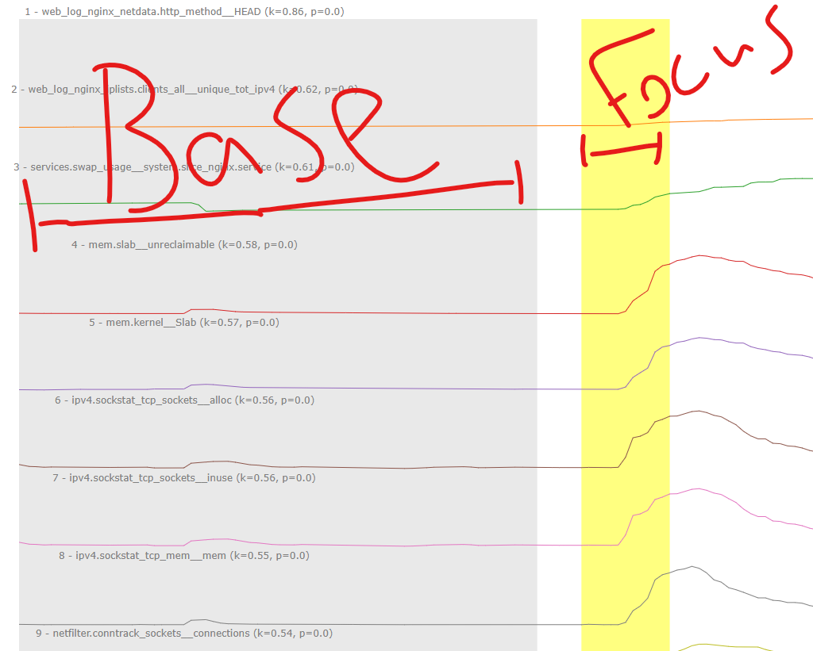
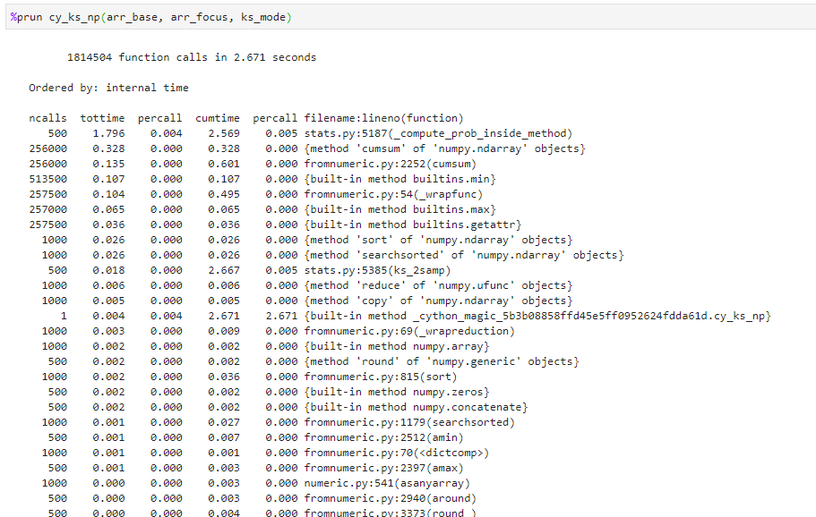
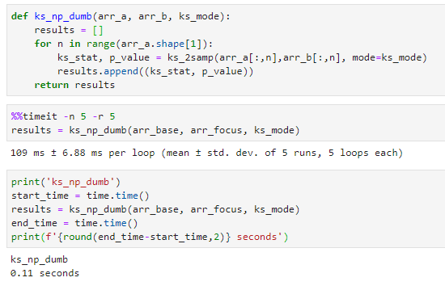

I've been doing some work that necessitated using the same statistical test from spicy lots of times on a fairly wide pandas dataframe with lots of columns. I spent a bit too much time googling around for the most efficient ways to do this, and even more time re-writing things various way before realizing i should have [RTFM](https://en.wikipedia.org/wiki/RTFM#:~:text=RTFM%20is%20an%20initialism%20for,the%20product%20manual%20or%20documentation.) a bit more in the first place, yep i've gone about a week down a path of premature optimization - but hey, \*blog post\* :)

## The Set Up

I have a wide pandas dataframe of lots of time series metrics - one for each column, and i have a 'focus' window of time during which i am interested to know what metrics look like the may have changed in some way in reference to a 'baseline' window just before the focus window.



A rough first idea (before getting too fancy and building models - not there yet for various reasons) is to break out our old friend the [KS Test](https://en.wikipedia.org/wiki/Kolmogorov%E2%80%93Smirnov_test#:~:text=In%20statistics%2C%20the%20Kolmogorov%E2%80%93Smirnov,test\)%2C%20or%20to%20compare%20two) to basically do a statistical test to see if the each metric the 'focus' distribution looks statistically significantly different then the 'baseline' distribution. The idea being that those metrics that do look to have 'changed' in this sense between the two windows might be worth looking at first.

So a pretty simple set up and application. The tricky part was doing this as quickly as possible on a dataframe with around 500-1000 columns and anywhere between 1000-10000 rows of data as a rough typical usage scenario.

## Dumb Approach

So my first approach, as usual, is to do the dumbest thing i can and just get something that works and go from there. So here is my `ks_df_dumb()` function.

```python
def ks_df_dumb(df, ks_mode):
    """
    Take in a df, loop over each column, split into base and focus, and apply test.
    """
    results = []
    for col in df._get_numeric_data():
        base = df[df['window'] == 'base'][col].values
        focus = df[df['window'] == 'focus'][col].values
        ks_stat, p_value = ks_2samp(base, focus, mode=ks_mode)
        results.append((ks_stat, p_value))
    return results
```

If i run this on my test dataframe of 500 columns \* 1000 rows i see the below timings.

```python
%%timeit -n 5 -r 5
results = ks_df_dumb(df, ks_mode)
# 3.77 s ± 57.4 ms per loop (mean ± std. dev. of 5 runs, 5 loops each)
```

```python
print('ks_df_dumb')
start_time = time.time()
results = ks_df_dumb(df, ks_mode)
end_time = time.time()
print(f'{round(end_time-start_time,2)} seconds')
# ks_df_dumb
# 3.55 seconds
```

So about 3-4 seconds which is not great for what i need (it may end up being something a user clicks to trigger and so want to have them wait as little as possible for the results).

## Vectorize it?

So now i start messing around with super cool tricks to try and be a hero. I know better than to be looping over stuff in python and pandas, i know i'll try vectorize it!

```python
def ks_df_vec(df, ks_mode):
    """Take in a df, and use np.vectorize to avoid pandas loop.
    """
    
    def my_ks_2samp(a,b):
        """Wrapper function to pass args to vectorized function. 
        """
        return ks_2samp(a,b,mode='asymp')
    
    results = []
    base = df[df['window'] == 'base']._get_numeric_data().transpose().values
    focus = df[df['window'] == 'focus']._get_numeric_data().transpose().values
    ks_2samp_vec = np.vectorize(ks_2samp, signature='(n),(m)->(),()')
    results = ks_2samp_vec(base, focus)
    results = list(zip(results[0], results[1]))
    return results
```

Now i see:

```python
%%timeit -n 5 -r 5
results = ks_df_vec(df, ks_mode)
# 2.22 s ± 35.5 ms per loop (mean ± std. dev. of 5 runs, 5 loops each)
```

```python
print('ks_df_vec')
start_time = time.time()
results = ks_df_vec(df, ks_mode)
end_time = time.time()
print(f'{round(end_time-start_time,2)} seconds')
# ks_df_vec
# 2.16 seconds
```

So a bit better at just over 2 seconds but still not great given this is still only 1000 rows of data.

## Numpy?

Time to break out numpy! (confession: i never really learned numpy properly and find it very painful to work with and reason about the data and shapes etc as i do stuff to them - it all just feels so unnatural to me in some way - and i find it hard to keep track of things without and indexes or keys, i just don't trust myself with it - i know i'm not supposed to speak this out loud but hey).

So my approach now will be to just get the data into two separate numpy arrays and work solely with them.

```python
def ks_np_dumb(arr_a, arr_b, ks_mode):
    results = []
    for n in range(arr_a.shape[1]):        
        ks_stat, p_value = ks_2samp(arr_a[:,n],arr_b[:,n], mode=ks_mode)
        results.append((ks_stat, p_value))
    return results
```

```python
%%timeit -n 5 -r 5
results = ks_np_dumb(arr_base, arr_focus, ks_mode)
# 2.43 s ± 200 ms per loop (mean ± std. dev. of 5 runs, 5 loops each)
```

```python
print('ks_np_dumb')
start_time = time.time()
results = ks_np_dumb(arr_base, arr_focus, ks_mode)
end_time = time.time()
print(f'{round(end_time-start_time,2)} seconds')
# ks_np_dumb
# 2.22 seconds
```

```python
def ks_np_vec(arr_a, arr_b, ks_mode):
    
    def my_ks_2samp(a,b):
        return ks_2samp(a,b,mode=ks_mode)
    
    ks_2samp_vec = np.vectorize(my_ks_2samp, signature='(n),(m)->(),()')
    results = ks_2samp_vec(arr_a.T, arr_b.T)
    results = list(zip(results[0], results[1]))
    return results
```

```python
%%timeit -n 5 -r 5
results = ks_np_vec(arr_base, arr_focus, ks_mode)
# 2.2 s ± 38.7 ms per loop (mean ± std. dev. of 5 runs, 5 loops each)
```

```python
print('ks_np_vec')
start_time = time.time()
results = ks_np_vec(arr_base, arr_focus, ks_mode)
end_time = time.time()
print(f'{round(end_time-start_time,2)} seconds')
# ks_np_vec
# 2.29 seconds
```

Hmm - that did not seem to add too much, which i guess is kinda reassuring, it makes sense that the dumb numpy approach be a little bit faster then the dumb pandas one, but is comforting in that its not order of magnitudes different.

And makes sense the the numpy dumb and numpy vectorize are not that different as the docs for it state that its really [just still a loop](https://numpy.org/doc/stable/reference/generated/numpy.vectorize.html) (so to properly really vectorize it that means i'd probably have to do much more work to figure it out).

## Feck this time for Cython!!!

Hell yeah i'm going to cythonize the shit out of this! Let be honest this is what i've wanted to do the whole time, do something with cython so i can boast about it to all my friends and how i got this awesome speedup, even just by adding some typing information.

Lets go.

```python
%%cython

import numpy as np
cimport numpy as np
cimport cython
from scipy.stats import ks_2samp

DTYPE = np.double

cpdef cy_ks_np(double[:, :] arr_a, double[:, :] arr_b, str ks_mode):

    cdef double k, p
    cdef Py_ssize_t i
    cdef Py_ssize_t m = arr_a.shape[1]
    
    result = np.zeros((m, 2), dtype=DTYPE)
    cdef double[:, :] result_view = result

    for i in range(m):
        k, p = ks_2samp(arr_a[:,i], arr_b[:,i], mode=ks_mode)
        result_view[i,0] = k
        result_view[i,1] = p

    return result
```

Ahhh look at it, very pleased with it if i do say so myself. I manged to wrangle [this tutorial](https://cython.readthedocs.io/en/latest/src/userguide/numpy_tutorial.html) to fit my needs. Went to bed that night very pleased with myself.

But...whats this...

```python
%%timeit -n 5 -r 5
results = cy_ks_np(arr_base, arr_focus, ks_mode)
# 2.28 s ± 54 ms per loop (mean ± std. dev. of 5 runs, 5 loops each)
```

```python
print('cy_ks_np')
start_time = time.time()
results = cy_ks_np(arr_base, arr_focus, ks_mode)
end_time = time.time()
print(f'{round(end_time-start_time,2)} seconds')
# cy_ks_np
# 2.1 seconds
```

2.2 Seconds!!! What the heck i was expecting some magical voodoo that would at least 10x speed me up, come on cython don't do this to me, i was going to be a hero, they were going to chant my name in the office.

So i did what was the logical next step - made a reproducible example and [asked StackOverflow](https://stackoverflow.com/questions/62195718/looping-over-a-scipy-function-lots-of-times-in-cython-not-seeing-much-improvem) to do it for me :)

## Bro, do you even Profile!

So while i waited on SO to do its thing i asked a few real engineers in my company what they thought. And their first response was - did you profile your code?

I began to panic, i've been found out, oh no its happening so i quickly looked the jupyter cell magic to profile my functions.



Well would ya look at that - 500 calls to `stats.py:5187(_compute_prob_inside_method)` taking up ~1.8 of my ~2 seconds.

Turns out this whole exercise has been a bit of a waste of time so far. So i went back and dug into the [ks\_2samp()](https://docs.scipy.org/doc/scipy/reference/generated/scipy.stats.ks_2samp.html) docs and the [code on github](https://github.com/scipy/scipy/blob/v1.4.1/scipy/stats/stats.py#L6087-L6282) to see if anything could be done.

Wait whats this `mode` parameter - maybe i can play with that a bit, oh one option is "_‘asymp’ : use asymptotic distribution of test statistic_" that sounds like it could be faster than "_exact_".

So with `ks_mode='asymp'` i ran things again and held my breath.



Lo and behold the solution was staring me in the face all along, obviously someone has already provided some sort of knobs and parameters to get a faster implementation under the hood.

As per usual i should have stuck to my number 1 rule of writing as little code as possible and trying to use other peoples good work to make myself look better :)

p.s. all the code is in a notebook [here](https://github.com/andrewm4894/random/blob/master/scipy_cython_ks_2samp_performance_benchmark.ipynb).
