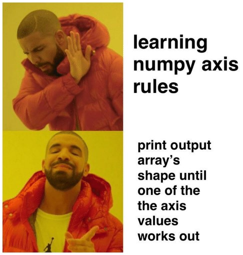

## The Setup

This is a little one I was surprised to see. Recently I had a need to do some pretty basic feature engineering to a pandas dataframe prior to training some models. Basically I needed to take differences of each column, apply some smoothing, and then add a number of lagged columns for each feature.

The beauty of pandas is that this took me about 5 minutes to bash together and is really clear for anyone else to read who may pick up the code later.

```python
def make_features_pd(df, lags_n, diffs_n, smooth_n):
    if diffs_n >= 1:
        df = df.diff(diffs_n).dropna()
    if smooth_n >= 2:
        df = df.rolling(smooth_n).mean().dropna()
    if lags_n >= 1:
        df = pd.concat([df.shift(n) for n in range(lags_n + 1)], axis=1).dropna()
    return df
```

Basically three lines of code, very clear and straightforward, job done and move on.

However the particular application I was using this for has some sensitivities around performance (is related to some monitoring functionality and so should try to be as lightweight as possible). So I decided to see if I could re-implement my "make\_features" function in [Numpy](https://numpy.org/) and if that would give me any performance gains (as we all love Numpy don't we?....don't we :) ).

I settled in for what turned out to be a whole evening of googling around to try various approaches in Numpy.

**Side note**: I hate using numpy and probably only really understand about 50% of the things I've ever done with it. I actually find it one of the most unintuitive things I've ever worked with and am now comfortable enough in my own skin to put this out there.

Anyway, below is what I ended up with (again after quite a lot of googling, which I am very good at :) ) - nice, clean, unintuitive and not very legible - I must be onto something.

```python
def make_features_np(arr, lags_n, diffs_n, smooth_n, colnames):
    
    def lag(arr, n):
        res = np.empty_like(arr)
        res[:n] = np.nan
        res[n:] = arr[:-n]
        return res
    
    if diffs_n > 0:
        arr = np.diff(arr, diffs_n, axis=0)
        arr = arr[~np.isnan(arr).any(axis=1)]

    if smooth_n > 1:
        arr = np.cumsum(arr, axis=0, dtype=float)
        arr[smooth_n:] = arr[smooth_n:] - arr[:-smooth_n]
        arr = arr[smooth_n - 1:] / smooth_n

    if lags_n > 0:
        colnames = colnames + [f'{col}_lag{lag}' for lag in range(1,lags_n+1) for col in colnames]
        arr_orig = np.copy(arr)
        for lag_n in range(1,lags_n+1):
            arr = np.concatenate((arr, lag(arr_orig, lag_n)), axis=1)
        arr = arr[~np.isnan(arr).any(axis=1)]

    return colnames, arr
```

## The Results

So I generated a little toy example dataset to see if my evening had been wasted or not.

```python
import numpy as np
import pandas as pd

# input params
n_rows = 10000
n_cols = 10
lags_n = 5
smooth_n = 5
diffs_n = 1

# make some data
df = pd.DataFrame(np.random.rand(n_rows,n_cols), columns=[f'col_{n}' for n in range(1,n_cols+1)])
arr = df.values
colnames = list(df.columns)
print(df.shape)
df.head()
```


Now some `%%timeit` magic and we shall see...


And there we have it - a **2.09x speed up!** I'll take that for the sake of an evening off from Netflix (was an easy sell anyway as my wife is currently knee deep in re-watching Glee).

[Here](https://colab.research.google.com/drive/1HaMrCM9v-HokL-AohEriHrszAmvpRoSh?usp=sharing) is a Google Colab with all the code.

Now I just need to figure out how to easily pull the columns for each feature from the Numpy array by name :)

```python
def get_array_cols(startswith, colnames, arr):
        cols_idx = [i for i, x in enumerate(colnames) if x.startswith(startswith)]
        return arr[:,cols_idx]
```
