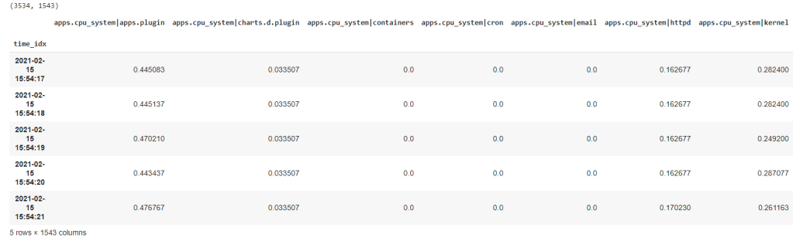
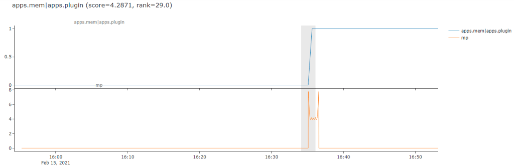
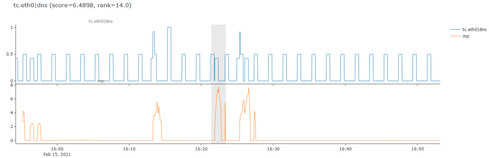
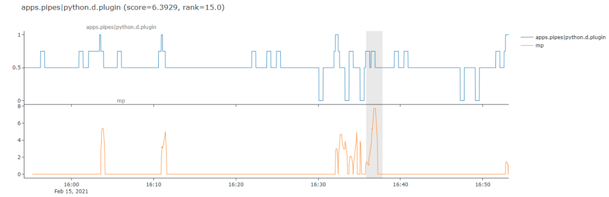
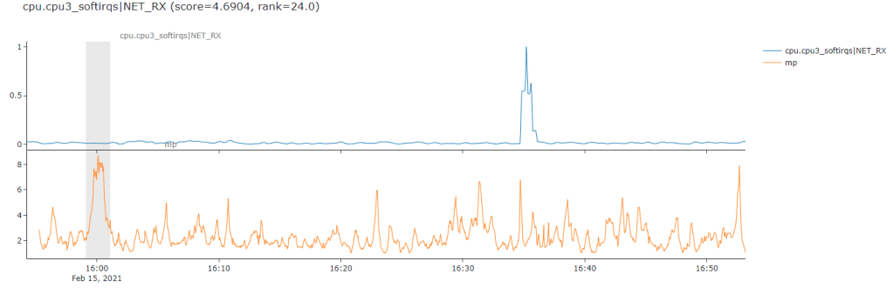

I like an excuse to play with fancy things, so when i first learned about the [Matrix Profile](https://matrixprofile.org/#:~:text=The%20matrix%20profile%20is%20a,scalable%20and%20largely%20parameter%2Dfree.) for time series analysis, particularly around anomaly detection, i was intrigued. When i learned there was a nice python package ([STUMPY](https://stumpy.readthedocs.io/en/latest/index.html)) i could just pip install i was outright excited, as one thing i like more than something fancy, is something fancy where someone has already done most of the work for me :)

**Note**: [here is a colab notebook](https://colab.research.google.com/drive/1Pkzk0PVWThNePdjVOTZrxERCXPB2b_Sw?usp=sharing) you can just run and play with for yourself.

My use case is time series anomaly detection on monitoring data from [Netdata](http://github.com/netdata/netdata) (where i work). [Here](http://london.my-netdata.io/) is an example demo dashboard i will use for illustration. Basically what i want to do is pull an hour of data from my server, compute the matrix profile for each metric in that data (about 1500 metrics) and then use the matrix profile for each metric to in some way rank metrics and surface the most anomalous looking via some sort of scoring and ranking.

**tl; dr**: the Matrix Profile computes subsequence distances within your time series and so subsequences with a larger distance to any other observed subsequences in your time series are more unique in some sense of being the most distant/different and so, possibly, anomalous. There are lots of other ways to use the Matrix Profile and the [STUMPY tutorials](https://stumpy.readthedocs.io/en/latest/Tutorial_The_Matrix_Profile.html) do a great job explaining them. Or if you are more of a YouTube video type of person (as i am) check [this one](https://youtu.be/WvaBPSeA_JA) out.

So i need to compute all the matrix profiles, and then also score and rank them in some way to find what are the most interesting ones in terms of my anomaly detection use case.

First let's define some inputs and pull some data.

```python
# install required libraries as needed
#!pip install netdata-pandas scipy==1.5.4 stumpy==1.8.0 plotly am4894plots

# imports
from datetime import timedelta
import numpy as np
import pandas as pd
import time
import stumpy
from netdata_pandas.data import get_data
from am4894plots.plots import plot_lines, plot_lines_grid

# inputs
hosts = ['london.my-netdata.io']
charts_regex = '.*'
before = 0
after = -60*60*1
smooth_n = 30

# get the data
df = get_data(hosts=hosts, charts_regex=charts_regex, after=after, before=before, index_as_datetime=True)
df = df[[col for col in df.columns if 'uptime' not in col]]
df = df.rolling(smooth_n).mean().dropna()
print(df.shape)
df.head()
```

Now we are in our happy place, we have all the data we need in a nice clean pandas dataframe. About ~3500 rows (one per second) and ~1500 columns each of which is a time series metric we are monitoring.



The next step is to use STUMPY to generate the matrix profile for each metric (or a large sample of them which is what i have done in the notebook for convenience while exploring the idea). Then we also need to decide what matrix profiles are 'good' ones for anomaly detection. It's not much use just returning ~1500 matrix profiles to a user - we need to try surface the most interesting ones to the top of the pile.

One of the main things to remember about the matrix profile is that the higher values represent sequences in the time series that are the furthest away from any other sub sequences and as such these are where the anomalies are most likely to be.

```python
# define some objects to store results in
scores = {}
mp_dists = {}

# sample n_cols just to be quicker
n_cols = 500

# sample some metrics
df_samp = df[np.random.choice(df.columns, n_cols, replace=False)]

# normalize the data prior to computing the mp so that the scores we use are all somewhat comparable across metrics on different scales
df_samp = ((df_samp-df_samp.min())/(df_samp.max()-df_samp.min()))
df_samp = df_samp.dropna(how='all', axis=1)
df_samp = df_samp.dropna(how='all', axis=0)

# loop over each metric
for col in df_samp.columns:

    # get the mp
    m = 60
    x = df_samp[col]#.diff().dropna()
    mp = stumpy.stump(x, m=m, ignore_trivial=True)
    mp_dist = mp[:, 0]

    # score the mp based on distance between the 99.5th percentile and 80th percentile
    df_mp_dist = pd.DataFrame(mp_dist).rolling(smooth_n).mean()
    score = df_mp_dist[0].quantile(0.995) - df_mp_dist[0].quantile(0.8)
    scores[col] = score

    # pad out the start of the mp_dist with nan's
    n_fill = len(df_samp[col]) - len(mp_dist)
    filler = np.empty(n_fill)
    filler.fill(np.nan)
    mp_dist = np.concatenate((filler, mp_dist.astype(float)))
    
    # save the mp
    mp_dists[col] = mp_dist
```

So my, admittedly simplistic (i like to do the dumbest thing i can get to work), approach to ranking each matrix profile was to score them based on the distance between the 99.5th percentile (e.g. very largest values) and the 80th percentile. The idea here is that a good looking matrix profile is one with clear spikes where the highest matrix profile values as as far away as possible from all the other matrix profile values. In this setting, a higher score (distance between 99.5th and 80th percentile) should tend to be a more "interesting" matrix profile for the purpose of anomaly detection.

Below is a nice clear example of what i mean. The line on the top is the raw time series while the orange line below is the computed matrix profile of subsequence distances (my sequence length in this case was 60 for 1 minute). We can see that the matrix profile distances clearly jump and 'stand out' from all the other matrix profile values just as the 'step' occurs in the raw data. So this is a nice example where its worked pretty good on this somewhat simplistic example of a level shift type anomaly.



This approach generally does a good job at finding anomalies like that above. Sometimes it's actually even maybe too fancy for me and picks out cases like the next one, where it seems to really focus on the appearance of one on/off step in between a more regular cycle of on/off traffic. This is actually the hardest part about anomaly detection, for sure it has found a novel or interesting unusual pattern below but it's most likely not an anomaly in the sense that a user in my domain might care about.



Here is an example that might make this point a bit more obvious, it seems for certain types of messy jumpy and somewhat random data the matrix profile based anomaly detection might be a little too sensitive for what i need.



This gets us into the even more difficult aspect of anomaly detection - the subjective nature of it all, different types of time series and different domains you are working in - it all matters.

Here is probably one of the worst way's this approach did not quite work for me. It seems to have really gotten excited about a particularly flat part of the time series and fully ignored the huge spike over to the right which is the more obvious (to a human eye) anomaly.



So its a case of needing to go back to the drawing board on this one after some initial prototyping. I think i might need to think a bit more about various preprocessing steps i might want to do like smoothing, differencing etc. and think about more about my scoring metric to maybe get something a little be more nuannced perhaps. Or more realisticly, but less sexy, additional post processing heuristics and rules to filter out "false positives" (in some sense) based on domain specific knowledge for my use case.

Anyway, just wanted to share this quick little example of finding something fancy, implementing a quick prototype, finding mixed results and then iterating on this cycle of dispair as is what 80% of DS/ML is like in reality :)

Onto the next fancy thing in the hope of glory!

**Update**: Sean Law ([@seanmylaw](https://twitter.com/seanmylaw)), one of the maintainers of STUMPY, [tweeted to me](https://twitter.com/seanmylaw/status/1368405672585424898) about trying out \`normalize=False\` parameter as it might help with my use case. Pleased to say that it seems to have helped a lot from some initial results so i am going to continue to explore this as another potentially different but complementary approach to some anomaly detection work i am doing.
