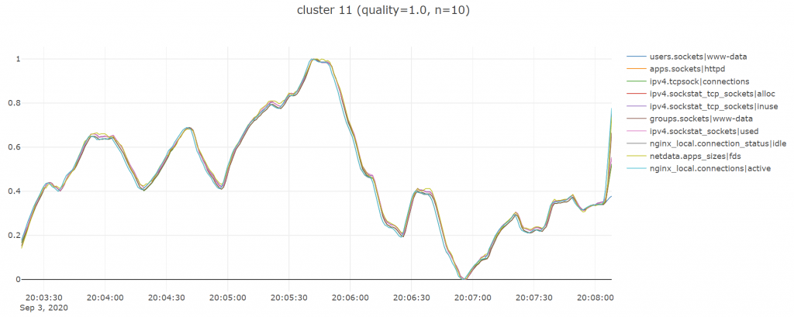
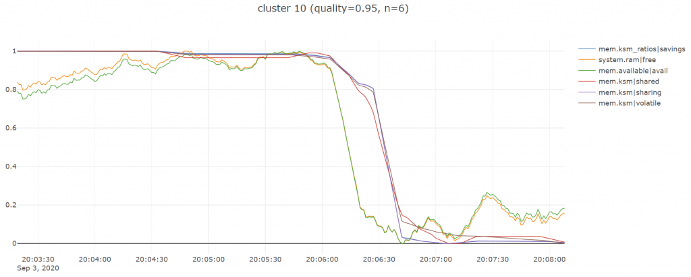
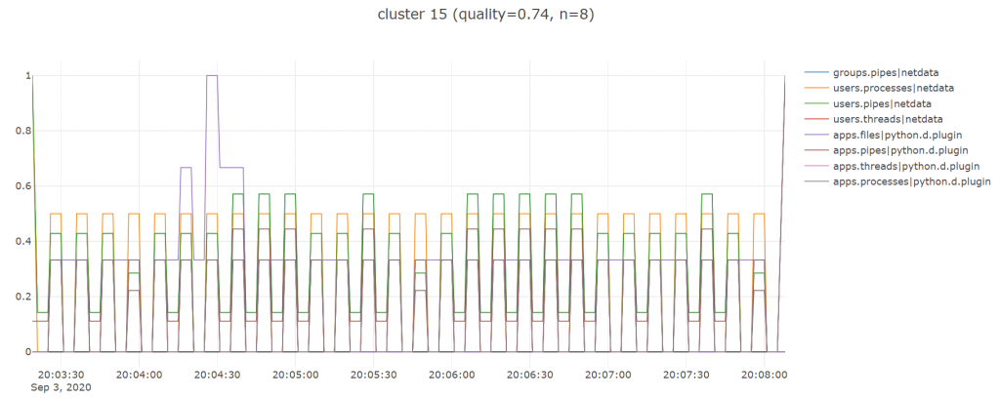
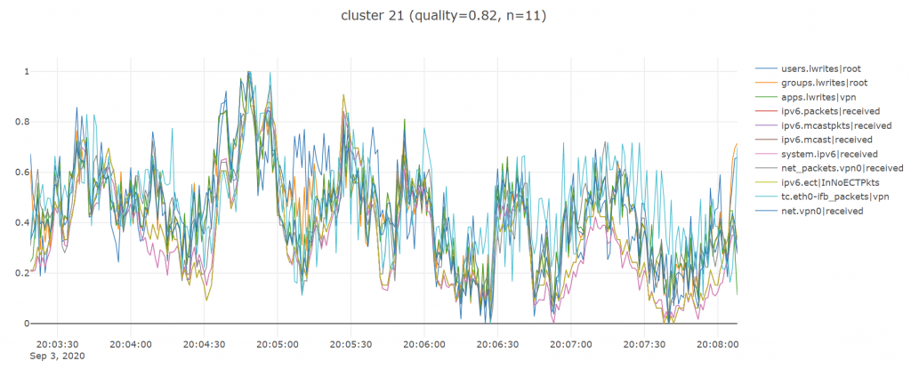
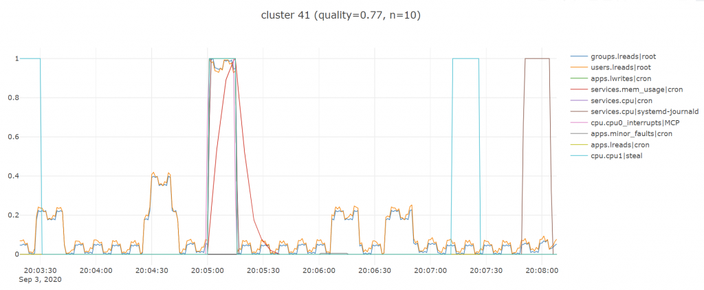
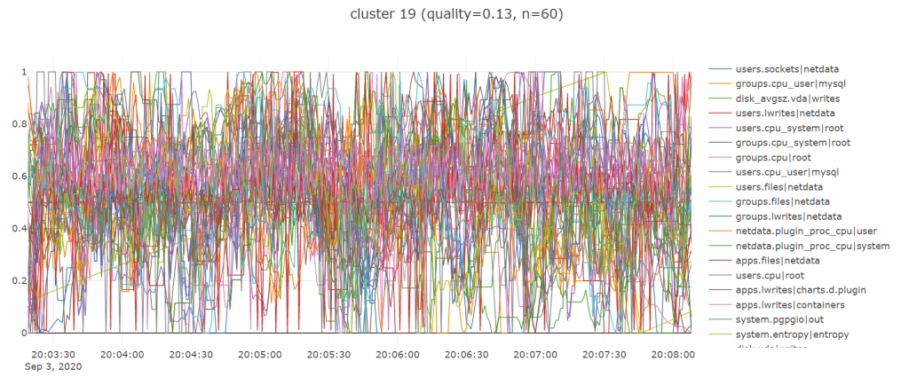
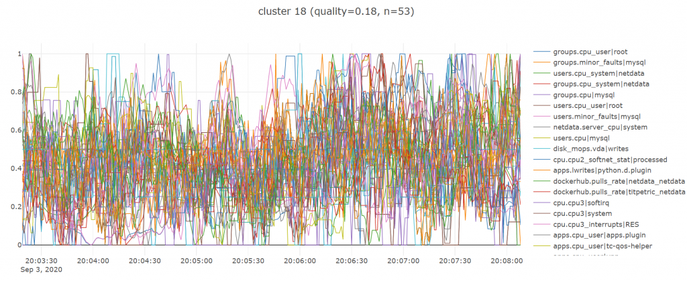
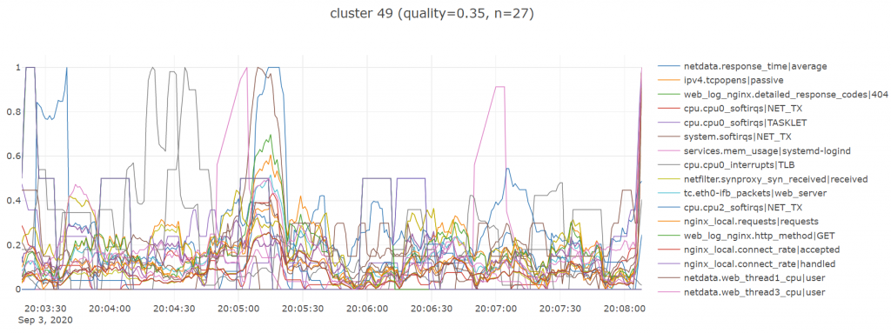

I've recently been playing around with some time series clustering tasks and came across the [tslearn](https://tslearn.readthedocs.io/en/stable/index.html) library. I was interested in seeing how easy it would be to get up and running some of the [clustering](https://tslearn.readthedocs.io/en/stable/gen_modules/tslearn.clustering.html#module-tslearn.clustering) functionality that is already built into tslearn, turns out it was quite easy and straight forward, perfect blog post fodder :)

**tl;dr** [here](https://colab.research.google.com/drive/1ngpyXDYcDfbaVu_TVhalUuGsoDRqQJa8?usp=sharing) is a Google Colab notebook you can just copy, run and play with for yourself.

First lets import the libraries we will need:

```python
import pandas as pd
import numpy as np
from tslearn.clustering import TimeSeriesKMeans, KShape, KernelKMeans
from tslearn.preprocessing import TimeSeriesScalerMeanVariance
from netdata_pandas.data import get_data, get_chart_list
from am4894plots.plots import plot_lines, plot_lines_grid
```

[netdata\_pandas](https://netdata.github.io/netdata-pandas/) is a helper library i created to pull some time series data from servers running [Netdata](https://www.netdata.cloud/) (where i work) into a pandas dataframe. In this example we will use a demo server, [http://london.my-netdata.io/](http://london.my-netdata.io/), so as to have somewhat realistic (messy) time series data.

[am4894plots](https://am4894plots.readthedocs.io/en/latest/) is another library i made for myself that i add common plotting functionality i find myself returning to time and time again (because i never really 'learned' matplotlib and at this stage refuse to!).

Lets define our inputs, basically anything that is something we can play with and change is worth adding as an input at top of the notebook:

```python
# inputs
host = 'london.my-netdata.io' # host running netdata that we want to pull data from
n = 60*5 # how many seconds of most recent data to pull
n_charts = None # If None then pull data for all charts otherwise sample n_charts randomly
n_clusters = 50 # number of clusters to fit
diff = False # take diffs of the data or not
preprocessing_meanvar = False # True to use TimeSeriesScalerMeanVariance preprocessing
smooth_n = 15 # n observations to smooth over
smooth_func = 'mean' # one of ['mean','min','max','sum']
norm = True # normalize the data to 0-1 range
model = 'kmeans' # one of ['kmeans','kshape','kernelkmeans','dtw']
```

Next we will get our data and do some fairly standard pre-processing:

```python
# get charts
if n_charts:
    charts = np.random.choice(get_chart_list(host), n_charts).tolist()
    print(charts)
else:
    charts = get_chart_list(host)
# get data
df = get_data(host, charts, after=-n, before=0)
# remove duplicate columns that we might get from get_data()
df = df.loc[:,~df.columns.duplicated()]
# drop any empty columns (it can happen)
df = df.dropna(axis=1, how='all')
# forward fill and backward fill to try remove any N/A values
df = df.ffill().bfill()
# take differences if specified
if diff:
    df = df.diff()
# do any smoothing as specified
if smooth_n > 0:
    if smooth_func == 'mean':
        df = df.rolling(smooth_n).mean().dropna(how='all')
    elif smooth_func == 'max':
        df = df.rolling(smooth_n).max().dropna(how='all')
    elif smooth_func == 'min':
        df = df.rolling(smooth_n).min().dropna(how='all')
    elif smooth_func == 'sum':
        df = df.rolling(smooth_n).sum().dropna(how='all')
    else:
        df = df.rolling(smooth_n).mean().dropna(how='all')
# normalize the data if specified
if norm:
    df = (df-df.min())/(df.max()-df.min())
# drop any empty columns that may remain
df = df.dropna(axis=1, how='all')
# set index to be a datetime for better plotting later
df = df.set_index(pd.to_datetime(df.index, unit='s'))

# look at our data
print(df.shape)
df.head()
```

Now time to build our clustering model using tslearn (there is a few more parameters here we probably should have added as separate inputs but not to worry):

```python
# get values to cluster on
X = df.transpose().values
if preprocessing_meanvar:
    X = TimeSeriesScalerMeanVariance().fit_transform(X)
    df = pd.DataFrame(X.reshape(df.shape), columns=df.columns, index=df.index)
if model == 'kshape':
    model = KShape(n_clusters=n_clusters, max_iter=10, n_init=2).fit(X)
elif model == 'kmeans':
    model = TimeSeriesKMeans(n_clusters=n_clusters, metric="euclidean", max_iter=10, n_init=2).fit(X)
elif model == 'dtw':
    model = TimeSeriesKMeans(n_clusters=n_clusters, metric="dtw", max_iter=5, n_init=2).fit(X)
elif model == 'kernelkmeans':
    model = KernelKMeans(n_clusters=n_clusters, kernel="gak", max_iter=5, n_init=2).fit(X)
else:
    model = TimeSeriesKMeans(n_clusters=n_clusters, metric="euclidean", max_iter=10, n_init=2).fit(X)
```

Once we have our clusters we can make some helper objects to use later:

```python
# build helper df to map metrics to their cluster labels
df_cluster = pd.DataFrame(list(zip(df.columns, model.labels_)), columns=['metric', 'cluster'])

# make some helper dictionaries and lists
cluster_metrics_dict = df_cluster.groupby(['cluster'])['metric'].apply(lambda x: [x for x in x]).to_dict()
cluster_len_dict = df_cluster['cluster'].value_counts().to_dict()
clusters_dropped = [cluster for cluster in cluster_len_dict if cluster_len_dict[cluster]==1]
clusters_final = [cluster for cluster in cluster_len_dict if cluster_len_dict[cluster]>1]
clusters_final.sort()

df_cluster.head()
```

Finally, the fun part, lets plot each cluster separately and see what we have:

```python
for cluster_number in clusters_final:
    # get a rough quality score based on the correlation between metrics in the cluster
    x_corr = df[cluster_metrics_dict[cluster_number]].corr().abs().values
    x_corr_mean = round(x_corr[np.triu_indices(x_corr.shape[0],1)].mean(),2)
    # plot each cluster
    plot_title = f'cluster {cluster_number} (quality={x_corr_mean}, n={cluster_len_dict[cluster_number]})'
    plot_lines(df, cols=cluster_metrics_dict[cluster_number], renderer='colab', theme=None, title=plot_title)
```

Here are some good examples:











And some not so good ones:







As is typical with clustering you are always going to get some pretty bad random looking ones, especially since i have really just picked a lot of the parameters above off the top of my head, most importantly k the number of clusters which i set to 50 given the high number of metrics we had (over 700).

All in all, i found the tslearn library very useful as it saved me quite a bit of time to get a quick working prototype up and running so i'm looking forward to also playing with some of the other time series related functionality it offers.
