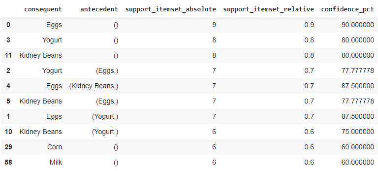

<figure>


<figcaption>

An actual market basket I found in my Google photos.

</figcaption>

</figure>

**tl; dr;** if you find yourself doing some association rule mining using [mlxtend](http://rasbt.github.io/mlxtend/) but finding it a bit slow then checkout [PyFIM](https://borgelt.net/pyfim.html) - [here is a colab](https://colab.research.google.com/drive/15UunWEtO3Ga_4KAfmDOXbv0FDVv2dhWH?usp=sharing) I made to get you started.

I have recently been looking to do some market basket analysis ("[Association rule learning](https://en.wikipedia.org/wiki/Association_rule_learning)") on event log type data (to find insights about what types of events tend to occur together).

After a quick bit of Googling it seemed like the [mlxtend](http://rasbt.github.io/mlxtend/) library was a pretty good place to start as it has some great [examples](http://rasbt.github.io/mlxtend/user_guide/frequent_patterns/apriori/#example-1-generating-frequent-itemsets) and [documentation](http://rasbt.github.io/mlxtend/user_guide/frequent_patterns/apriori/) as well as a pretty good community.

However once I got my use case up and running I was finding mlxtend, while easy to use, was very slow in terms of running time. I tried to tweak a few things as best I could but still was finding it way too slow for what I would need. I was beginning to feel like my bright idea might turn out to be a dead end after all :( .

But then I came across [this issue](https://github.com/rasbt/mlxtend/issues/644) in the repository that seems to help explain some of the slowness and offer some glimmers of hope maybe. Slow, Slow, Java? hmm, PyFIM, 149 ms - hello!

I'd been googling around for about a week and this was the first I had seen of [PyFIM](https://borgelt.net/pyfim.html) which seems to be a wrapper library for a lower level C based implementation of some common itemset mining algorithms (you had me at "C wrapper" :) ).

So hope was restored and I began to play with PyFIM - which took me about two days to get going with as the documentation, while insanely detailed, is quite old school and academic (which is probably why Google didn't just send me there in the first place when I was originally searching around).

And indeed it was faster, much faster.

To hopefully save anyone else this effort I decided to bash together a quick [Google colab notebook](https://colab.research.google.com/drive/15UunWEtO3Ga_4KAfmDOXbv0FDVv2dhWH?usp=sharing) and share it in this post.

**Note**: You can also see the notebook on Github [here](https://nbviewer.jupyter.org/github/andrewm4894/colabs/blob/master/pyfim_explore.ipynb) via nbviewer.

There is not much to the example so here is a quick walk through. You should definetly check out the docs too by using `??arules` if in jupyter or colab.

Set up some inputs for support (`supp`), confidence (`conf`) and `report` (which will determine what metrics you get back).

```python
# inputs
supp = 2 # minimum support of an assoc. rule (default: 10)
conf = 50 # minimum confidence of an assoc. rule (default: 80%)
report = 'asC'
```

Create a toy dataset of transactions to play with, in the format expected by PyFIM.

```python
# create a toy dataset of transactions
dataset = [['Milk', 'Onion', 'Nutmeg', 'Kidney Beans', 'Eggs', 'Yogurt'],
           ['Dill', 'Onion', 'Nutmeg', 'Kidney Beans', 'Eggs', 'Yogurt'],
           ['Milk', 'Apple', 'Kidney Beans', 'Eggs'],
           ['Milk', 'Unicorn', 'Corn', 'Kidney Beans', 'Yogurt'],
           ['Corn', 'Onion', 'Onion', 'Kidney Beans', 'Ice cream', 'Eggs'],
           ['Milk', 'Unicorn', 'Corn', 'Yogurt', 'Eggs'],
           ['Milk', 'Unicorn', 'Eggs', 'Kidney Beans', 'Yogurt'],
           ['Corn', 'Onion', 'Onion', 'Kidney Beans', 'Yogurt', 'Eggs'],
           ['Corn', 'Yogurt', 'Onion', 'Kidney Beans', 'Ice cream', 'Eggs'],
           ['Milk', 'Unicorn', 'Corn', 'Yogurt', 'Eggs'],
           ]
```

Make a little helper dictionary to give more meaningful names of the fields you can ask for.

```python
# make dict for nicer looking column names
report_colnames = {
    'a': 'support_itemset_absolute',
    's': 'support_itemset_relative',
    'S': 'support_itemset_relative_pct',
    'b': 'support_bodyset_absolute',
    'x': 'support_bodyset_relative',
    'X': 'support_bodyset_relative_pct',
    'h': 'support_headitem_absolute',
    'y': 'support_headitem_relative',
    'Y': 'support_headitem_relative_pct',
    'c': 'confidence',
    'C': 'confidence_pct',
    'l': 'lift',
    'L': 'lift_pct',
    'e': 'evaluation',
    'E': 'evaluation_pct',
    'Q': 'xx',
    'S': 'support_emptyset',
    }
```

Run the `arules` function on your data with your inputs.

```python
# run apriori
result = arules(dataset, supp=supp, conf=conf, report=report)
```

And, as always, wrangle your results into a pretty Pandas dataframe.

```python
# make df of results
colnames = ['consequent', 'antecedent'] + [report_colnames.get(k, k) for k in list(report)]
df_rules = pd.DataFrame(result, columns=colnames)
df_rules = df_rules.sort_values('support_itemset_absolute', ascending=False)
print(df_rules.shape)

# look at some higher support rules
df_rules.head(10)
```

And you should see some results like below.



mmmm, eggs and kidney beans and yogurt :)

**Update**: After more playing around it seems a huge part of the 'slowness' I was seeing with mlxtend (and even was also crashing pyfim - and my machine lol) was that I had some 'baskets' of events that had 300+ items in them and this was just blowing things up even though I was only looking at hundreds of 'transactions' from the event logs. Luckily for me the vast majority of these were sort of dirty data that slipped in and was safe for me to exclude. So now I'm using both mlxtend and pyfim, now next challenge will be to explain the results and concepts like support, confidence and lift to my non technical end users - fun times :)
