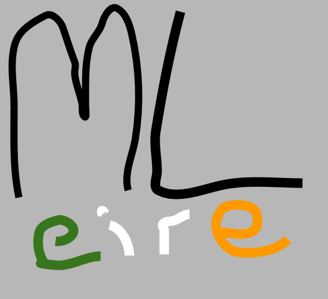

<figure>

<figcaption>

as it looks - made in about 20 seconds in google drawing :)

</figcaption>

</figure>

I've been thinking for a while that there really should be some go-to online community for people interested in ML and ireland in some way. I was fairly surprised to find that none really existed when i went to find one to join.

So, being the genius that i am, i decided to just make a slack and share it around to see if any interest. I'd be happy to spend a bit of free time trying to nurture and develop such a community as really think it's something that should exist. There's lots of great meetups and Python Ireland is great but none really seem to have a online forum/community.

http://irishtechcommunity.com/ is the best i've found so far of something already out there but the ML and DS channels in there are a bit barron and i feel like what would be really cool would be something like the the twimlai community (https://twimlai.com/community/ - which is great and 100% worth joining) but with a sort of focus or interest in ireland in some vague way.

anyway **tl dr**; join the slack maaan! https://join.slack.com/t/machine-learning-ire/shared\_invite/zt-lf2z50mt-rcaQ6nQdKsEtjjkY7jZUbg

update: i also made a meetup page, mainly as a sort of place to direct people and seo.

https://www.meetup.com/machine-learning-ireland-slack-community/
