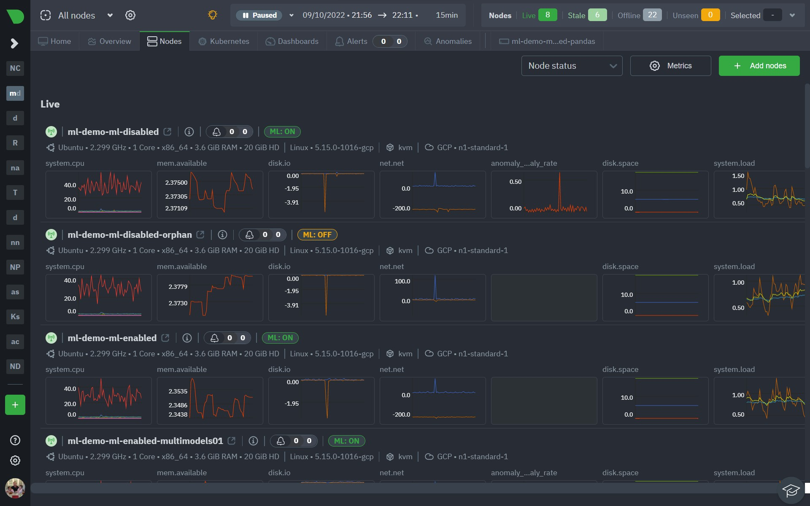

import ReactPlayer from 'react-player'

# Netdata example blog post

This is an example showing things we like to be able to do in blog posts.



<!--truncate-->

## Code blocks are easy

Here is a yaml code block.

```yaml
doe: "a deer, a female deer"
 ray: "a drop of golden sun"
 pi: 3.14159
 xmas: true
 french-hens: 3
 calling-birds:
   - huey
   - dewey
   - louie
   - fred
 xmas-fifth-day:
   calling-birds: four
   french-hens: 3
   golden-rings: 5
   partridges:
     count: 1
     location: "a pear tree"
   turtle-doves: two
```

And a small python block.

```python
print('hello world')
```

We can also do `inline code` very easy too.

## Embedding videos also easy

Here is an embedded youtube video (works well on mobile too). 

<ReactPlayer controls width='100%' url='https://www.youtube.com/embed/nI4eZ_ojtfs' />

emojis easy too 😊 .. 

## Images can live next to blog content

Gif's are just like images so also easy.


Also easy to just resize,center as needed.

<center></center>

Things generally just work as expected and its all very painless.